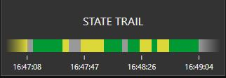
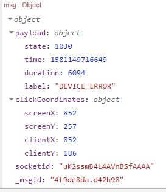
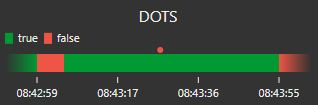

# node-red-contrib-state-trail

[![NPM version][npm-image]][npm-url]
[](https://www.codefactor.io/repository/github/hotnipi/node-red-contrib-ui-state-trail)


[npm-image]: http://img.shields.io/npm/v/node-red-contrib-ui-state-trail.svg
[npm-url]: https://www.npmjs.com/package/node-red-contrib-ui-state-trail


## Description


Node-RED dashboard widget. Gantt type chart to visualize state changes over time period.

### Alert 
Breaking change with version 0.3.0. 

If you were using the output of this node and your flow the makes use of <code>msg.clickCoordinates</code>, you will need to change this property name to <code>msg.event</code>

## Configuration
### Label
To show label configure widget height to 2 units. 
  
### Period
Time period. If configured to long period, keep input rate low. Too much data may harm performance significantly. [See also about the scaling time](#The-scaling-time)

Configured period can be overrided by using <code>msg.control.period</code> property.
The value for period should be given in milliseconds. 

For example to set period to 5 minutes, send 
``` javascript
msg.control = {period:300000}
```
        

### Time format and Ticks
Choose format of time and count of tick marks.
     
### States
Configure at least 2 states. Type of state can be <code>string</code>, <code>number</code> or <code>boolean</code>.  
States can be configured with mixing the types. States <code>true</code> (boolean) and <code>"true"</code> (string) treated as different states. 

Optionally you can configure label for each state. If configured, the legend shows the label instead of state.  

### Blank label
Text to show when there is not yet enough data to display the chart. 

### Legend
To show the legend, the widget height must be configured to 2 units. 
Legend can be configured for 3 modes. It even shows information for all the configured states or for states currently in timeline or only for latest state       

By clicking the legend on dashboard, you can toggle between names and summary. Summary shows aggregated time or percentage for each state.

### Combine similar states
By default, the node combines consecutive states if they have same value. You could turn this behavior off, if you wanted to present your data as it was provided. 
Doing so, the consecutive similar states will be splitted with thin lines, and all those states will be individually clickable.
If splitting the consecutive similar states is not intentional or if you don't use click option, it is recommended to keep this option selected. 
For large amounts of data, combining the states helps to gain performance.

### Data Storage
After a full re-deploy, Node-RED restart or system reboot, the node will lose it's saved chart data, unless the user has selected the 'Data Storage' option (checkbox) AND enabled a persistent form of context storage in the Node-RED settings.js file. In that case, the node will attempt to restore the data as it was prior to the re-deploy, restart or reboot.

See the node-RED user guide to configure persistent storage - https://nodered.org/docs/user-guide/context#saving-context-data-to-the-file-system

## Input
        
<code>msg.payload</code> should carry single value of one of configured states
``` javascript
msg.payload = true
```

If you want to use the widget to show historical data, you need to pass in every state together with its timestamp. 
``` javascript
msg.payload = {state:true,timestamp:1579362774639}
```

Historical data can be also feed within an array

``` javascript
msg.payload = [
    {state:true,timestamp:1579362774639},
    {state:false,timestamp:1579362795665},
    {state:true,timestamp:1579362895432}
]
```

State data can also have the end time. In this case, if next state starts later than the previous state's end time, then there will be gap between states in case of combining the states is turned off.

``` javascript
{"state": true,"timestamp": 1581404193000,"end":1581404198000}
```

Note, that feeding data in array will clear previous set of data!

To clear the data, send an empty array 
``` javascript
msg.payload = []
```


## Output

By clicking the chart bar, the widget sends message. Output msg contains clicked state in <code>msg.payload</code> and coordinates of click in <code>msg.event</code>. The order of values in <code>event.bbox</code> is <code>left bottom right top</code>  


 


## The scaling time.

Widget scales the time to fit the data which satisfies configured period into graphics. This means that time slices change their width while the widget has been running less than configured period.
Such scaling may lead to the circumstances where state with short duration can not be rendered anymore. This is technical limitation which cannot be avoided.
To identify that such short state is currrently in the timeline, the widget draws small dot with the state color above the bar. It may happen, that dot and small line of state are both drawn.



It is possible to calculate the shortest state duration guaranteed to be drawn by widget. If you are expecting states with duration less than the safe time, consider configuring shorter period or to make widget wider.

Safe minimum duration is not the absolute limit, the widget can render smaller units, but without any guarantee.

### Calculations
Safe duration calculation bases on Site Sizes, widget size and configured period.
```
WS – 	1x1 widget size (Dashboard configuration)
WSP – 	widget spacing (Dashboard configuration)
STS –	widget width in units (state-trail configuration)
WW –	widget width in pixels 
P – 	configured period 
Dm –	minimum safe duration

Formula to calculate widget size in pixels

WW = (WS * STS) + (WSP * (STS – 1))  -  12

To find out minimum safe duration 

Dm = P / WW / 2
```

Example with standard dashboard configuration, widget width 6 units and configured period 1h (3600 sec)
```
WW = (48 * 6) + (6 * (6 - 1)) – 12 = 306
Dm = 3600 / 306 / 2 = 5,88 sec
```


## Change the configuration at runtime

Some options of widget configuration can be overrided at runtime by using the <code>msg.control</code> property.

### Change configured period
Configured period can be overrided by using <code>control.period</code> property.
The value for period should be given in milliseconds. 

For example to set period to 5 minutes, send 
``` javascript
msg.control = {period:300000}
```

### Change the states

All states can be overrided by using <code>control.states</code> property. Note that you can't adjust or change any of configured states individually.

**All states must be unique!**

New states expected to be sent in <code>array</code> of <code>objects</code>
``` javascript
var s = [
    {state:1 ,col:"#009933", t:"num", label:'ONE'},
    {state:'two', col:"#999999", t:"str", label:'TWO'},
    {state:false, col:"#00FF99", t:"bool", label:'THREE'}
]
msg.control = {states:s}
```
Where each <code>object</code> must have all following properties
``` 
state - (number,string,boolean) the state identifier
col - (hex string) the color of the state
label - (string) human-friendly name of the state (empty string for no label)
t - (string) the type of the state.
   
    values for t can be:
    "num" - number
    "str" - string
    "bool" - boolean

```

